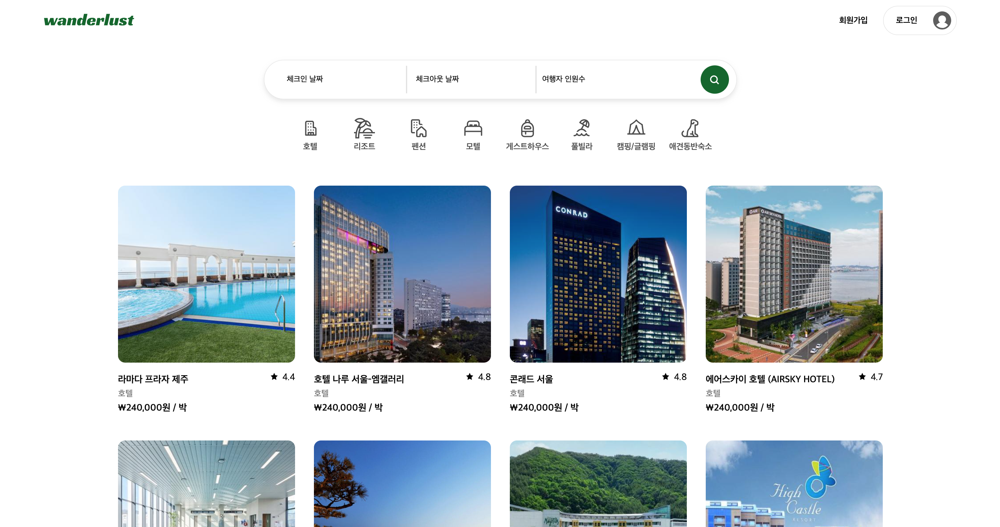
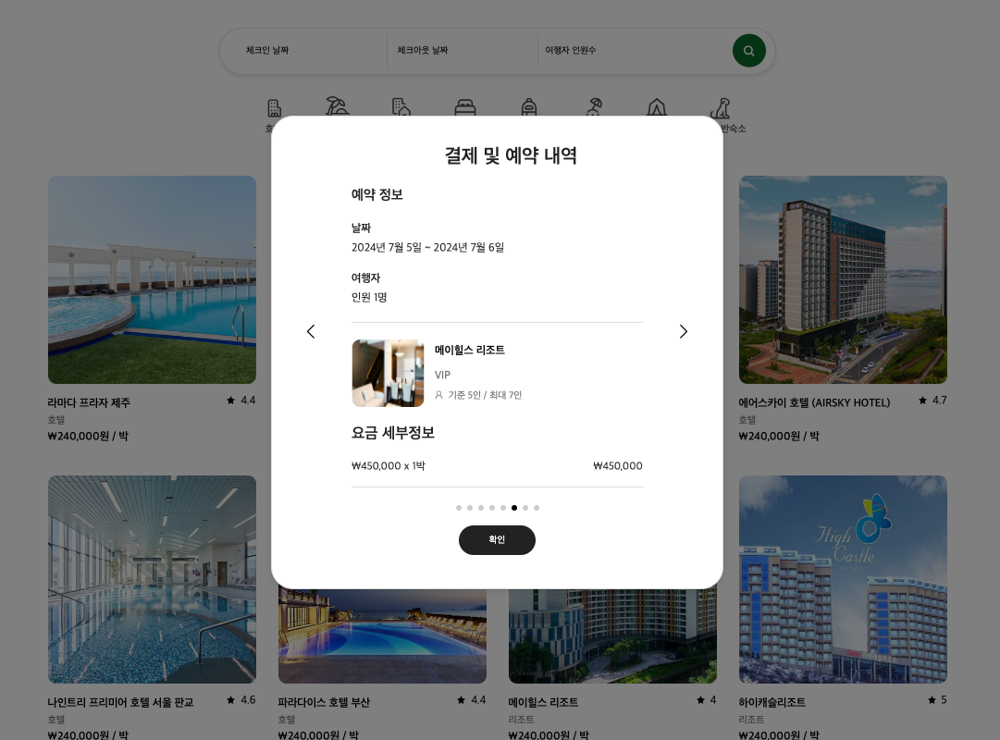

# Wanderlust 숙박 예약 서비스

## 프로젝트 개요

Wanderlust는 넓은 세상을 경험하고자 여행을 떠나고 싶은 마음을 의미합니다. 전체적인 UI 디자인은 대표적인 숙박 예약 서비스 Airbnb와 야놀자 사이트를 참고해서 큰 얼개를 짜고, 프로젝트에서 구현할 세부적인 내용을 기획했습니다. 프론트엔드와 백엔드 팀원이 함께 REST API를 구성하고, http request와 response를 통해 데이터를 주고 받는 과정을 공부하는 미니 프로젝트입니다.

#### <u>프로젝트 기간</u>

2024년 6월 17일 - 7월 5일

#### <u>배포링크</u>

https://wanderlust-mini4.netlify.app/

id: wander2@wander.com 
pw: Abcd1234\*

## 미니 프로젝트 4조 프론트엔드 소개

<strong>김희용</strong> (https://github.com/scripto1) 
개발 환경 설정 및 배포, 전체 상품(카테고리 분류), 개별 상품, 객실 페이지
  
<strong>정보현</strong> (https://github.com/jeongbohyeoun) 
전체 상품 검색, 개별 상품 검색, 결제 페이지, 결제 내역 확인
  
<strong>호프니콜라</strong> (https://github.com/nicola-laura) 
회원 가입 및 로그인 기능, 헤더 컴포넌트, UI 디자인
  

## 기술 스택

   

  
 

## 유저 플로우

## 각 페이지 설명

### A. 개발 환경 설정 및 배포, 전체 상품(카테고리 분류), 개별 상품, 객실 페이지 (김희용)

### 구현 내용

#### 1. 개발 환경 설정 및 배포

- vite로 react 개발 환경을 설정하고 프로젝트에 필요한 라이브러리 패키지를 개발용과 배포용으로 구분해서 설치했습니다. esbuild로 사전 번들링이 가능해 build 시간을 단축할 수 있기 때문에 vite를 사용했습니다.
- 이전 프로젝트에서도 사용했던 netlify 서비스를 활용해서 프로젝트를 최종 배포했습니다. 한번 배포하면 자동으로 github 내용을 추적해서 내용을 반영하는 점이 편리합니다. 이번 프로젝트에는 데이터를 http request/response를 통해서 받았는데, api 주소가 http이고 netlify는 보안이 강화된 https 이외에는 허용하지 않아서 충돌이 발생했습니다. 다행히 api URL을 PROXY로 우회 설정하면서 http api 주소를 사용할 수 있었습니다.

#### 2. 전체 숙박 상품 (카테고리 분류)

- tanstack query의 useInfiniteQuery를 사용해서 숙박 리스트를 8개씩 분할해서 화면에 보여줍니다. useInView훅을 활용해서 스크롤이 페이지 하단에 위치하면 fetchNextPage 함수로 그 다음 8개 리스트를 받아오면서 무한 스크롤을 구현했습니다.
  현재는 전체 숙박 데이터를 받아 프론트엔드에서 분할해서 보여주는 방식인데, 데이터가 방대할 경우를 대비해서 백엔드와 프론트엔드가 동시에 페이지를 분할하는 방식을 구현할 예정입니다.
- 숙박 카테고리를 선택하면 해당 숙박 종류만 분류해서 화면에 구현했습니다.

#### 3. 개별 숙박 상품 페이지 및 객실 페이지

- tanstack query와 fetch를 사용해서 숙박 업체의 이름, 카테고리, 별점, 설명을 동적으로 화면에 보여줍니다. 각 객실에 할당된 img1과 img2를 5개씩 분리해서 img1 묶음은 그리드 형식으로 상단에 배치하고, img2 묶음은 각 객실 이미지로 사용했습니다.
- 객실 선택에서 '예약하기'를 클릭하면 예약 및 결제하기 페이지로 이동하고, 잔여 객실 수가 0이 되면 '예약 마감'으로 버튼을 전환하고 객실 상세보기도 표시하지 않습니다.
- 객실 상세 페이지에서는 객실 내 서비스 및 부대시설 여부를 boolean 값으로 받아 해당하는 서비스 목록만 화면에 표시합니다.

### 문제 해결 및 느낀 점

- 백엔드 과정과 처음으로 협업하는 프로젝트라 서버에서 보내는 데이터를 내가 잘 주고 받을 수 있을 지 기대와 두려움으로 처음 몇 주를 보낸 것 같습니다. 프로젝트 초반에는 MSW(mock service worker)로 예상할 수 있는 http request와 response를 시물레이션 해볼 수 있었지만, 단순히 api 주소만 교체하고 끝나지는 않을거라고 짐작은 하고 있었습니다. 백엔드에서 보내 준 api를 통해 key value를 맞추고 객체인지 배열인지 파악하고, 그에 맞춰서 적절한 메소드를 선택하고 사용하는 부분이 쉽지 않았습니다. 특히 실제 서버와 통신하면서 발생하는 CORS (로컬 서버의 호스트와 포트번호가 api 서버의 그것과 다르기 때문에 발생.) 이슈와 netlify가 api 서버의 http 프로토콜을 지원하지 않으면서 부딪히는 문제를 해결하면서 네트워크도 부지런히 공부해야겠다고 생각했습니다.
- 이전 프로젝트에서는 스타일 컴포넌트만 사용해서 SCSS 사용할 기회가 없었는데, 이번 프로젝트에 적용하면서 공부할 수 있어서 좋았습니다. tanstack query를 사용해서 http 통신과 무한 스크롤을 구현하는 부분도 처음 시도해봤는데, 덕분에 이전에 몰랐던 fetch 기능을 살펴보는 계기가 됐습니다. 담당한 내용에 전역 상태 관리가 없기는 했지만, 다양한 상태 관리 라이브러리를 적용해보지 못한 점이 다소 아쉽습니다.
- 멋진 UI디자인을 이틀만에 작업해서 스타일링을 빨리 시작할 수 있도록 도와주신 니콜라님과 막힌 문제를 뚝딱 풀어주시는 해결사 보현님께도 감사드립니다. 항상 빠른 대응으로 서버 관련 이슈를 해결해주신 백엔드 팀분들 덕분에 백엔드와 첫 프로젝트를 잘 마무리 할 수 있었습니다. (회식을 프로젝트 초반에 한 번 더 했어도 괜찮지 않았을까라는 생각이 듭니다.)
- 시간이 허락한다면 메인 페이지 각 숙소 업체의 이미지를 슬라이드 형식으로 구현하고 싶고, 상태 관리 라이브러리도 적용해보고 싶습니다.

### B. 메인화면 검색 기능, 상품 개별화면 검색 기능, 결제 및 결제내역 확인 기능 (정보현)

### 구현 내용

#### 1. 메인 화면 검색 기능

- 체크인 날짜, 체크아웃 날짜, 인원 수 를 url 쿼리스트링으로 넣어서 검색 기능 구현
- 카테고리 필터링과 연계해서 카테고리 지정 후 검색 시 카테고리를 포함한 검색값이 나오도록 구현
- 검색 값 설정 후 개별 상품 조회 시 url 쿼리스트링의 검색 값 유지. (상태관리)
- 미설정 시 체크인 날짜는 오늘 일자, 체크아웃 날짜는 내일 일자, 인원 수는 1명으로 되도록 벡엔드와 의견 조율함.
- 체크인 날짜, 체크아웃 날짜 클릭 시 캘린더로 날짜 설정할 수 있도록 구현.

#### 2. 상품 개별화면 검색 기능

- 메인 화면에서 검색 값 설정 후 특정 상품 이미지 클릭 시, 검색 필드의 초기 값이 메인 화면 검색값으로 설정됨. (url 쿼리스트링으로 받아옴)
- 개별 화면에서 검색 값 변경 시 url 쿼리스트링을 그에 맞게 변경하고 그에 해당하는 룸 데이터가 나옴 (상태관리) .
- (결제 페이지, 개별상품 상세페이지 -> 결제페이지) 에서 데이터를 받아올 수 있도록 url 쿼리스트링을 사용해서 상태관리를 통해 데이터 전달

#### 3. 결제 페이지 결제 기능

- 결제 페이지에 필요한 데이터를 url 쿼리스트링으로 받아와서 해당 데이터 표시
- 결제 버튼 클릭 시, POST method 를 통해 백엔드로 request 보냄

#### 4. 결제 내역 확인 기능

- Swiper 의 navigation, pagination 을 통해서 결제 내역이 두 개 이상일 때 Swiper 를 통해서 확인 가능
- 결제 내역이 한 개일 떄는 Swiper 사라지도록 구현.

### 좋았던 점

#### 1. 팀원분들이 굉장히 좋았습니다.

#### 2. url 쿼리스트링을 통한 상태관리를 처음 시도해봤는데, 앞으로도 자주 쓸 수 있을 것 같아서 좋았던 것 같습니다.

### 느낀 점

- 사실 처음엔 백엔드와 협업을 한다고 했을 때, 처음 경험하기 떄문에 뭘 어떻게 해야되는지 몰라서 좀 아찔했습니다.  
  백엔드와 api 명세서를 작성할 때도 get,post,request,response 에 대해서 이해도가 없어서 작성해주신 명세서를 토대로 모르는 부분을 많이 찾아보게 되었는데, 백엔드에서 api가 준비될 때까지 기다리는 것이 아니라 msw 로 가상 데이터를 설정해서 미리 GET, POST method 를 이용해 request, response 를 프론트 쪽에서 모의로 할 수 있다는 걸 알게 되어서 좋았습니다.  
  사실 백엔드에게 api를 받았을 때는 또 데이터를 주고받는 코드를 많이 수정해야 했지만, 그래도 이런 방법을 알게 되었고, 활용을 해봤다는 점에 있어서 의미가 있는 것 같습니다.
- 프로트엔드 팀원 분들이 정말 좋았습니다. 모든 부분에서 정말 좋았던 것 같습니다.
- 백엔드 분들도 소통도 잘해주셨고 밤을 새가면서까지 데이터를 꼼꼼하게 잘 전달해주신 부분에 있어서 감사한 것 같습니다.

### C. 회원 가입 및 로그인 기능, 헤더 컴포넌트, UI 디자인 (호프니콜라)

### 구현 내용

#### 1. 전체 UI 디자인 및 유저플로우 제작

#### 2. 회원가입 기능: 회원가입 모달창 구현

- 이메일 주소, 비밀번호, 이름 입력
- 유효성 검사 및 오류 처리

#### 3. 로그인 기능: 로그인 모달창 구현

- 이메일, 비밀번호 입력
- JWT access token 인증 처리
- 유효성 검사 및 오류 처리

#### 4. 헤더 네비게이션 컴포넌트:

- 로그인 상태 - 결제내역 확인, 로그아웃
- 로그아웃 상태 - 회원가입 및 로그인 모달창을 통해 회원 인증

### 배운 점

- 로그인, 회원가입, 유효성 검사, protected route 등 처음으로 구현해보면서 많이 배웠습니다.
- 모의 API(MSW) 및 백엔드에서 받은 실제 API를 사용해봐서 fetch, axios 등에 대한 이해가 높아진 것 같습니다.

### 느낀 점

- 협업이 생각보다 원활하게 이루어졌고, 잘 진행되었습니다.
- JWT 인증이 예상과 동일하게 복잡하고 어려웠습니다.
- 페이지보다 모달창 구현이 더 어려운 것 같습니다. context 작성을 포함한 모달창 관련 이슈가 많았습니다..
- 팀원들이 정말 최고였습니다! 많은 도움을 주셨고, 코드를 보면서 많이 배울 수 있었습니다.
